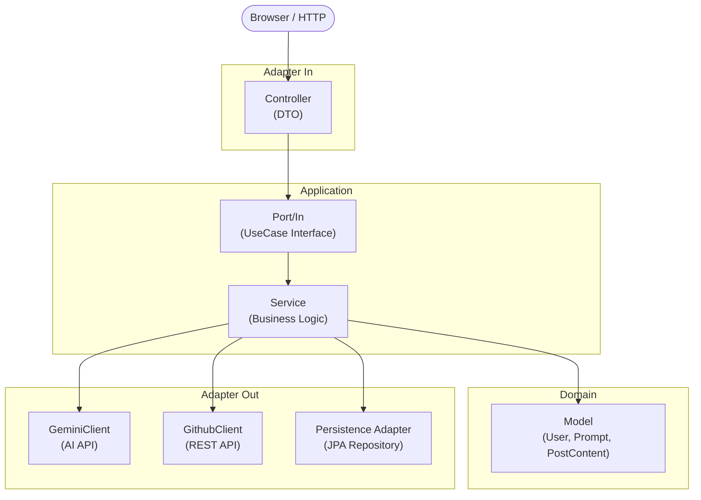

# AutoBlog


> AI 프롬프트를 통해 블로그 글을 자동 생성하고, GitHub 레포지토리에 바로 업로드하는 Spring Boot 웹 애플리케이션

---

## 주요 기능

- **AI 콘텐츠 생성** — 텍스트 및 이미지 첨부 프롬프트로 마크다운 형식의 블로그 글 자동 생성 (Google Gemini 2.5 Flash)
- **GitHub 자동 업로드** — 생성된 마크다운 파일을 GitHub REST API를 통해 지정한 레포지토리에 직접 commit
- **마크다운 프리뷰** — 생성된 콘텐츠를 CommonMark 기반으로 브라우저에서 즉시 렌더링
- **회원 인증** — 자체 로그인(BCrypt 암호화, 단일 세션 정책), OAuth2 확장 구조
- **API 문서** — SpringDoc OpenAPI(Swagger UI) 자동 생성

---

## 아키텍처

헥사고날 아키텍처(Ports & Adapters) 패턴을 적용하여 도메인 로직과 외부 시스템을 명확히 분리했습니다.



### 레이어 간 변환 규칙

| 변환 | 위치 | 메서드 |
|:---:|:---:|:---:|
| DTO → Command | Controller / DTO | `toCommand()` |
| Command → Domain | Domain | `from(Command)` |
| Domain → Entity | Entity | `from(Domain)` |
| Entity → Domain | Entity | `toDomain()` |
| Domain → DTO | DTO | `from(Domain)` |

---

## 기술 스택

| 분류 | 기술 |
|:---:|:---|
| Language | Java 21 |
| Framework | Spring Boot 3.5.8, Spring Security, Spring Data JPA, Spring WebFlux |
| View | Thymeleaf, Thymeleaf Layout Dialect |
| AI | Google GenAI SDK (Gemini 2.5 Flash) |
| External API | GitHub REST API v2022-11-28 (WebClient) |
| Database | H2 (개발), MySQL (운영) |
| Docs | SpringDoc OpenAPI (Swagger UI) |
| Markdown | CommonMark 0.26.0 |
| Build | Gradle |

---

## 주요 구현 포인트

### 헥사고날 아키텍처
도메인 모델이 외부 프레임워크나 DB에 의존하지 않도록 Port 인터페이스로 경계를 정의했습니다.
`PromptApiPort`, `GithubRestApiPort`, `UserOriginRepositoryPort` 등을 통해 어댑터를 교체해도 비즈니스 로직이 변경되지 않는 구조입니다.

### Google Gemini AI 연동
텍스트 단독 프롬프트와 이미지 첨부 프롬프트(멀티모달)를 모두 지원합니다.
`Prompt` 도메인 모델에 첨부파일 여부를 판단하여 내부적으로 분기 처리합니다.

```java
// GeminiClient.java
public String genTextByPrompt(Prompt prompt) throws Exception {
    if (prompt.promptFiles == null || prompt.promptFiles.length == 0) {
        return getTextByOnlyTextPrompt(prompt.promptText);   // 텍스트 전용
    }
    return getTextByPromptWithImage(prompt);                 // 멀티모달
}
```

### GitHub REST API 연동
파일 존재 여부(GET)를 먼저 확인한 후 create(PUT) 또는 update(PUT)를 분기 처리합니다.
Base64 인코딩된 마크다운 콘텐츠와 SHA를 사용해 GitHub Contents API와 통신합니다.

| 케이스 | 처리 |
|:---:|:---|
| 파일 미존재 (404) | Create API 호출 → 201 Created |
| 파일 존재 (200) | SHA 추출 후 Update API 호출 → 200 OK |
| 인증 실패 (401) | 사용자에게 토큰 확인 안내 |

### Spring Security 인증
- BCrypt 암호화 저장
- 단일 세션 정책 (동일 계정 중복 로그인 시 기존 세션 만료)
- 미인증 사용자의 프롬프트 접근 시 로그인 페이지로 리다이렉트

---

## 시작하기

### 사전 준비

- Java 21
- Google Gemini API Key ([발급 방법](https://aistudio.google.com/app/apikey))

### 환경 변수 설정

프로젝트 루트에 `.env` 파일을 생성합니다.

```
GEMINI_API_KEY=your_gemini_api_key_here
```

### 빌드 및 실행

```bash
./gradlew build
./gradlew bootRun
```

### 접속

| 경로 | 설명 |
|:---|:---|
| http://localhost:8080 | 애플리케이션 |
| http://localhost:8080/swagger-ui/index.html | API 문서 (Swagger UI) |
| http://localhost:8080/h2-console | H2 데이터베이스 콘솔 |

---

## 프로젝트 구조

```
src/main/java/com/sangsang/autoblog/
├── adapter/
│   ├── in/web/
│   │   ├── controller/          # HTTP 엔드포인트 (Auth, Content, Upload)
│   │   └── dto/                 # 요청/응답 DTO
│   └── out/
│       ├── api/                 # GeminiClient, GithubClient
│       └── persistence/
│           ├── adapter/         # Repository Port 구현체
│           ├── entity/          # JPA 엔티티
│           └── repository/      # Spring Data JPA
├── application/
│   ├── command/                 # UseCase 입력 Command 객체
│   └── service/                 # 비즈니스 로직 구현
├── domain/
│   ├── model/                   # 핵심 도메인 객체 (User, Prompt, PostContent)
│   └── port/
│       ├── in/                  # UseCase 인터페이스
│       └── out/                 # Repository / API Port 인터페이스
└── infra/config/                # Security, Swagger, DotEnv 설정
```

---

## 향후 계획

- [ ] OAuth2 소셜 로그인 (Google, GitHub)
- [ ] Notion API 연동 (GitHub와 동일한 Port 인터페이스로 확장)
- [ ] 이미지 프롬프트 안정화 및 Bulk 프롬프트 지원
- [ ] 이메일/SMS 인증 추가
- [ ] 접속 기록 및 프롬프트 이용 내역 로그
- [ ] 예외 처리 고도화 (API 에러, 인증 에러, 404 등)
- [ ] 단위 테스트 추가
